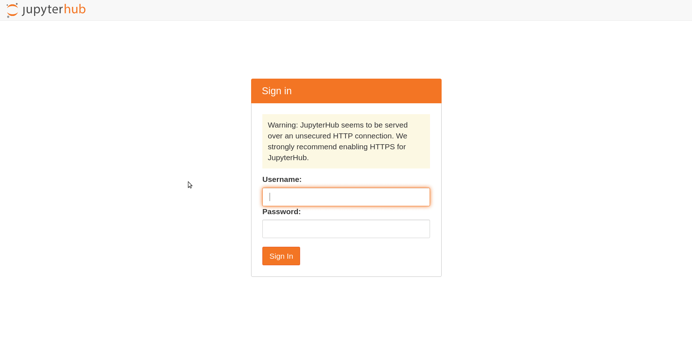

# Zero-to-Codehub

This repository contains a guide on how to deploy a multi-tenant Visual Studio Code installation
on your k8s cluster by stitching together two very nice projects:

* [Zero to Jupyterhub](https://zero-to-jupyterhub.readthedocs.io/en/latest/index.html): a guide (and helm charts) for deploying jupyterhub to k8s. Jupyterhub is a multi-tenancy installation for managing [jupyter notebooks](https://jupyter.org/).
* [code-server](https://github.com/cdr/code-server), an open-source ready-to-use VS Code installation (and docker image).

## Features

The Codehub brings you multiple nice features:
* Give developers the chance to start working on a project without any overhead or installation: a browser and credentials is all they need
* Scalable, low-maintenance, multi-tenancy installation of VS Code: every logged-in user gets its own running VS Code accessible via the browser.
  Optionally, you can add persistent storage, extensions, personalization...
* Use the huge ecosystem around jupyterhub for easily integrating and configuring authentication (LDAP, OAuth, active directory, simple, ...), HTTPS, resource management and storage, user customization and so much more

## Get started

If you have k8s, helm and a persistent storage provider not already set up, follow one of these [guides](https://zero-to-jupyterhub.readthedocs.io/en/latest/kubernetes/index.html) from the Zero to Jupyterhub documentation.

In principle, we just follow the remaining installation [guide](https://zero-to-jupyterhub.readthedocs.io/en/latest/jupyterhub/installation.html) to also install jupyterhub on k8s, but we use the supplied custom values file to choose the VS Code image.

Add the jupyterhub helm chart:

    helm repo add jupyterhub https://jupyterhub.github.io/helm-chart/
    helm repo update

Now clone or download the [values.yaml](./values.yaml) file and replace the `proxy.secretToken` by the output of `openssl rand -hex 32`.

After that, install the jupyterhub/codehub helm chart:

    helm upgrade --cleanup-on-fail --install codehub jupyterhub/jupyterhub --version=0.10.2  --values values.yaml

Wait for all pods to be running

    kubectl get pod

You can now visit your codehub on the external address of the `proxy-public` service

    kubectl get service

or by using a port forwarding

    kubectl port-forward svc/proxy-public 8000:80

and then visiting http://localhost:8000.

The default authenticator is a dummy authenticator which accepts any username or password combination.

**Attention**: this repository is for educative purposes only. It was not tested for security thoroughly. Giving users a full IDE with root access can be a severe security problem - even when "only" running in containers.

### Stopping your server

So far, there is no button to stop your server from within VS Code.
However, you can visit `<hub-address>/hub/home` and press "Stop My Server".

## Possible customizations

Behind the scenes, it is still a "normal" jupyterhub installation deployed via the battle-tested jupyterhub helm chart.
Therefore, every customization und extension already implemented in jupyterhub can probably used without any changes.

Examples are:
* Let users choose between different "profiles" (e.g. resources, predefined images), see [here](https://zero-to-jupyterhub.readthedocs.io/en/latest/jupyterhub/customizing/user-environment.html#using-multiple-profiles-to-let-users-select-their-environment)
* Customize user [resources](https://zero-to-jupyterhub.readthedocs.io/en/latest/jupyterhub/customizing/user-resources.html) and [persistent storage](https://zero-to-jupyterhub.readthedocs.io/en/latest/jupyterhub/customizing/user-storage.html)
* Using a different authenticator, e.g. OAuth2 (e.g. via github), LDAP, Active Directory. See [here](https://zero-to-jupyterhub.readthedocs.io/en/latest/administrator/authentication.html) for more information.
* Use HTTPS for encrypting the communication with the hub. See [here](https://zero-to-jupyterhub.readthedocs.io/en/latest/administrator/security.html#https) for more information.
* Automatically remove idle servers, see [here](https://zero-to-jupyterhub.readthedocs.io/en/latest/jupyterhub/customizing/user-management.html#culling-user-pods).

All the mentioned configurations can be controlled via the `values.yaml` file specified on helm chart installation.
When customizing, make sure to not overwrite the already present
settings needed for the VS code image.

The very good [documentation](https://zero-to-jupyterhub.readthedocs.io/en/latest/index.html) on the jupyterhub k8s installation also contains valuable information on monitoring and operating.

## How does it work

All components are already there - codehub just glues them together with very little glue-settings.
The basis is a normal jupyterhub installation.
Jupyterhub consists roughly of two components: the webfrontend (that your users will interact with) and a (reverse) proxy.
Whenever users log in via the webfrontend, jupyterhub spawns a new pod which normally contains the jupyter notebook server.
This is where codehub steps in: instead, a VS code instance is spawned.
The address of the running VS code instance is registered with the
proxy so that subsequent calls to the hub by this user will be redirected to the running VS Code directly.
That's it! The changes to jupyterhub are really small - because both jupyterhub and VS Code are already very nice projects!

